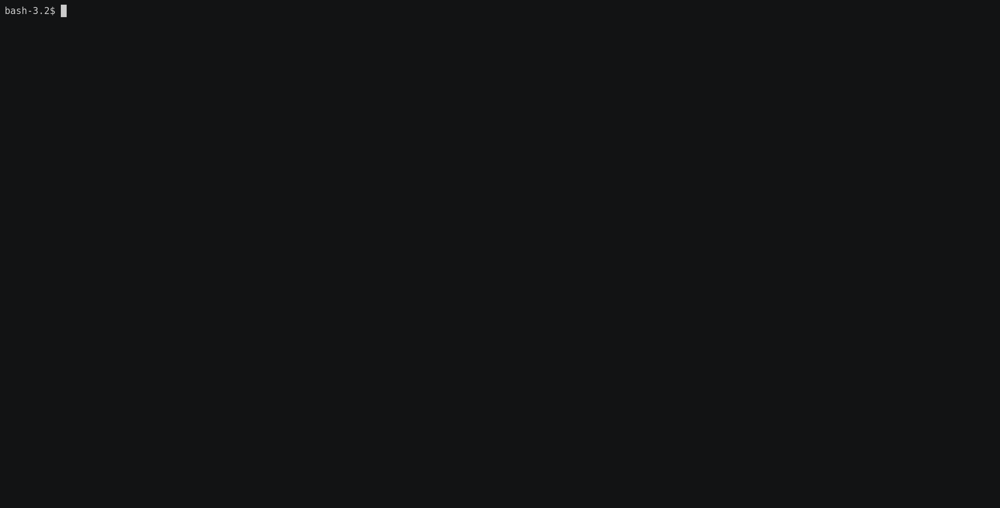

fail2ban-watcher-rs
=====

[](https://app.codacy.com/gh/romibuzi/fail2ban-watcher-rs?utm_source=github.com&utm_medium=referral&utm_content=romibuzi/fail2ban-watcher-rs&utm_campaign=Badge_Grade)

Display the most banned countries and ips from a [fail2ban](https://www.fail2ban.org) database.

### Demo



## Requirements

Rust : https://www.rust-lang.org/tools/install

### Build

```bash
cargo build --release
```

### Run

```bash
.target/release/fail2ban-watcher-rs --help
fail2ban-watcher-rs 1.0
Romain A. <romain.ardiet@gmail.com>

USAGE:
    fail2ban-watcher-rs [OPTIONS]

FLAGS:
    -h, --help       Prints help information
    -V, --version    Prints version information

OPTIONS:
    -f, --fail2ban-db-path <fail2ban-db-path>
            fail2ban db to analyze [default: /var/lib/fail2ban/fail2ban.sqlite3]

    -n, --nb-display <nb-display>                number of elements to display [default: 10]
```

### Tests

```bash
cargo test
```

### Cross compilation

```bash
cargo install cross
TARGET=x86_64-unknown-linux-gnu # https://doc.rust-lang.org/stable/rustc/platform-support.html
cross build --release --target=$TARGET

# then run the binary
./target/$TARGET/release/fail2ban-watcher-rs
```

### Credits

This project includes IP2Location LITE data available from http://www.ip2location.com
